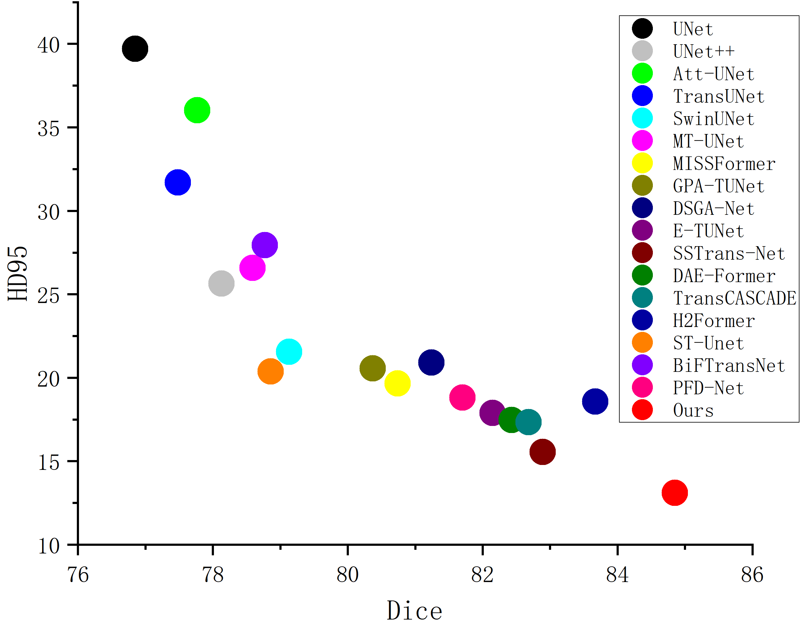

# MFTB-Net:Multi-Scale Feature Fusion Triplet Branch Network for Multi-organ Segmentation
 

# Architecture

# Comparison with other models

# Datasets
## Synapse
There are 30 abdominal CT scans in the
Synapse multi-organ segmentation dataset, and 3779 images
are labeled for eight organs: aorta, gallbladder, left kidney,
right kidney, liver, pancreas, spleen, and stomach. The data is
divided between 12 test instances and 18 training cases (2212
slices) based on the TransUNet and SwinUNet settings.
[Synapse](https://www.synapse.org/#!Synapse:syn3193805/wiki/217789)  
## ACDC
MRI scans from 100 patients with multiple
short-axis heart slices obtained during breath-hold are included
in the ACDC dataset. Following processing, the dataset has
1902 slices with labels for the myocardium (MYO), left
ventricle (LV), and right ventricle (RV). There are 20 test
samples and 80 training samples in the dataset.
[ACDC](https://www.creatis.insa-lyon.fr/Challenge/acdc/databases.html)  

## Requirements
pip install -r requirements.txt  
pip install causal_conv1d-1.0.0+cu118torch1.13cxx11abiFALSE-cp38-cp38-linux_x86_64.whl  
pip install mmamba_ssm-1.0.1+cu118torch1.13cxx11abiFALSE-cp38-cp38-linux_x86_64.whl  

The .whl files of causal_conv1d and mamba_ssm could be found here. [Baidu](https://pan.baidu.com/share/init?surl=Tibn8Xh4FMwj0ths8Ufazw&pwd=uu5k)
# train
python train.py --dataset Synapse --cfg configs/swin_tiny_patch4_window7_224_lite.yaml --max_epochs 300 --img_size 224 --base_lr 0.0001 --batch_size 16  
# test
python test.py --dataset Synapse --cfg configs/swin_tiny_patch4_window7_224_lite.yaml --is_savenii --max_epoch 300 --base_lr 0.0001 --img_size 224 --batch_size 16  
# References 
[UltraLight-VM-UNet](https://github.com/wurenkai/UltraLight-VM-UNet)  
[Swin UNet](https://github.com/HuCaoFighting/Swin-Unet)  
